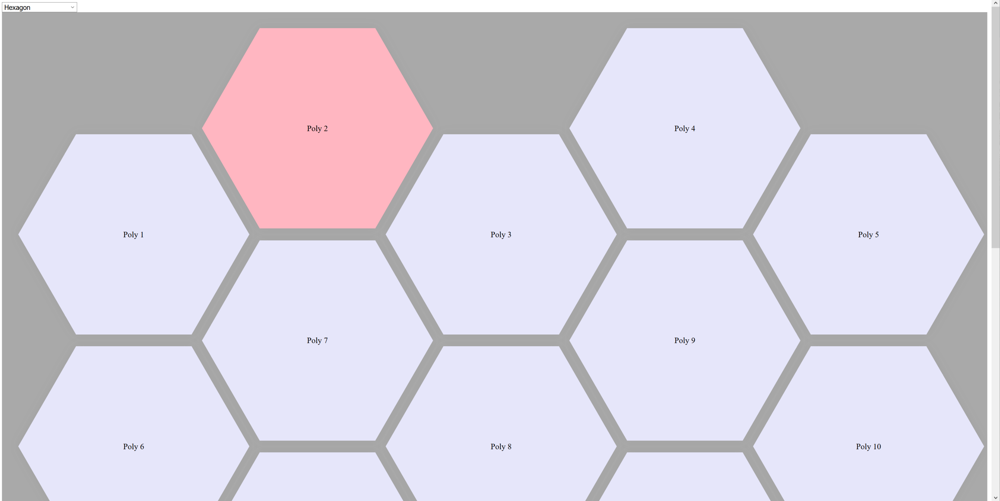

# Dynamic Polygonal Grid Webpage

This template manages the layout of various polygonal shapes on a webpage, dynamically adjusting the layout according to the screensize (webpage vs mobile, etc).

Grid items are independently selectable as links to other pages, links to downloads, or a decorative display of images/information.

Additionally, manages color-changing or resizing actions on mouse-hover events, highlighting the selected grid item.

